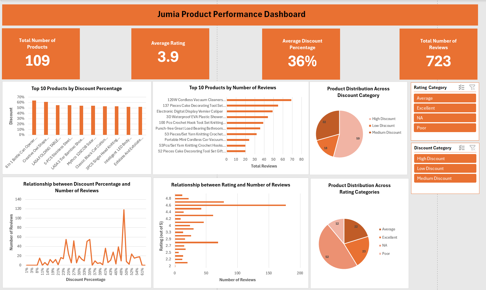

# Jumia Product Performance Dashboard

An interactive Excel dashboard analyzing pricing, discounts, and customer reviews for 109 products listed on Jumia, one of Africa's largest e-commerce platforms.

Built as part of the LuxDev Data Science Cohort 7 program.

## Project Overview

This project takes a raw dataset of Jumia product listings and walks through the full data analysis workflow: cleaning, enrichment, exploratory analysis, and dashboard creation, all within Microsoft Excel.

The goal was to understand how pricing, discounts, and ratings relate to customer engagement (measured by reviews), and to present those findings in a single interactive dashboard that could support e-commerce decision-making.

## Dataset

The dataset contains product-level data scraped from Jumia with the following fields:

| Column | Description |
|--------|-------------|
| Product | Product name |
| Current Price | Selling price in KSh |
| Old Price | Original price before discount in KSh |
| Discount | Discount percentage applied |
| Reviews | Number of customer reviews |
| Rating | Average customer rating out of 5 |

## Data Cleaning and Preparation

The raw data required several cleaning steps before analysis:

- Removed "KSh" text and commas from price columns using Find & Replace, then converted to numeric format
- Extracted numeric ratings from text strings like "4.5 out of 5"
- Converted negative review counts to positive values using `ABS()`
- Removed duplicate product entries (final count: 109 unique products)
- Handled missing values in the Reviews and Rating columns
- Trimmed extra whitespace from text fields

## Data Enrichment

Three new columns were created to support deeper analysis:

- **Discount Amount (KSh):** Old Price minus Current Price
- **Rating Category:** Poor (below 3), Average (3 to 4.4), Excellent (4.5 and above)
- **Discount Category:** Low (below 20%), Medium (20% to 40%), High (above 40%)

## Key Findings

### Snapshot

| Metric | Value |
|--------|-------|
| Total Products | 109 |
| Average Rating | 3.9 / 5 |
| Average Discount | 36% |
| Total Reviews | 723 |
| Price Range | KSh 38 to KSh 3,750 |

### Discounting is the norm, not the exception

54% of products (59 out of 109) fall into the High Discount category (above 40%), while only 17% have discounts below 20%. This suggests aggressive discounting is a widespread strategy on the platform rather than something reserved for select items.

### Higher discounts do not automatically drive more reviews

The most-reviewed product (118 reviews) carries a 49% discount, which is above average. However, the relationship is not linear. Several products with steep discounts have very few reviews, and some with modest discounts still attract strong engagement. Product type, visibility, and listing quality likely play a bigger role in driving customer interaction than discount size alone.

### Ratings and reviews have a loose positive relationship, with notable exceptions

Products with the most reviews overall (177 reviews) had a 4.6 rating, above the platform average of 3.9. This loosely supports the idea that better-rated products attract more attention. But the pattern breaks down at the extremes: the products with a perfect 5.0 rating had just 12 reviews, while a product rated 2.8 (below average) has accumulated 69 reviews. Factors like product demand and category popularity seem to matter as much as quality.

### Most products are rated reasonably well

Only about 11% of products fall into the "Poor" rating category (below 3.0). The majority sit in the "Excellent" (21%) and "Average" (20%) bands. This could reflect a baseline of product quality on the platform, or it may indicate that poorly rated products are eventually delisted.

## Conclusions

1. **Discount strategy needs rethinking.** With more than half of all products discounted above 40%, heavy discounting may be losing its effectiveness as a differentiator. Sellers relying on discounts alone to boost engagement should consider other levers like better product images, descriptions, and customer follow-up.

2. **Reviews are driven by more than price and ratings.** The data shows that neither steep discounts nor high ratings guarantee strong review counts. Platforms and sellers should focus on post-purchase engagement and review prompts to build social proof.

3. **Quality appears to be a baseline, not a differentiator.** Since most products are rated 3.0 or above, simply having a decent rating is not enough to stand out. Products competing for attention need to combine competitive pricing with strong visibility and compelling listings.

4. **The dashboard approach works.** Even with a relatively small dataset, having an interactive dashboard with slicers and KPI cards makes it significantly easier to spot patterns and communicate findings compared to looking at raw spreadsheet data.

## Tools Used

- Microsoft Excel (pivot tables, charts, slicers, formulas, conditional formatting)